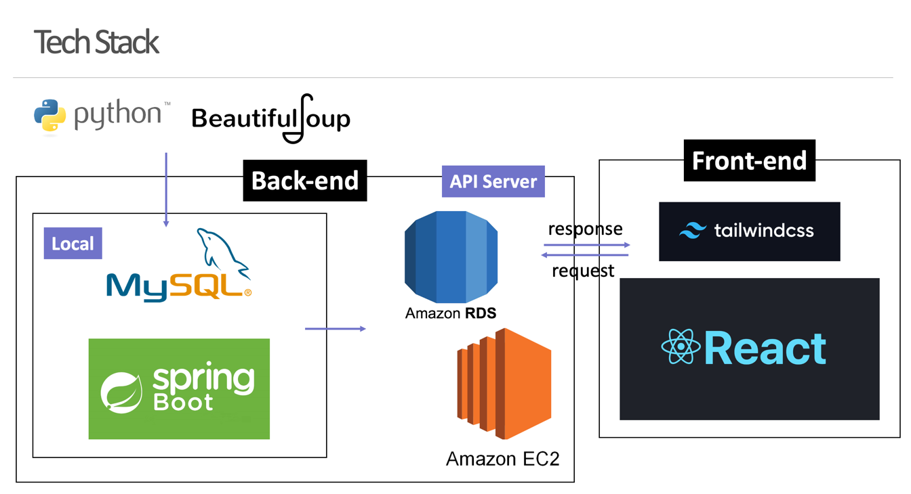

# ThisWeek 🏖

청춘들에게 이번 주의 문화생활을 제안하고 의견을 나누는 커뮤니티 웹 서비스
```ThisWeek``` 의 서버 레포지토리입니다.


## 👩🏻‍💻 Credit


## ✏️ Description
```Home```과 ```Community``` 기능으로 나뉩니다.

### Home

이번 주의 문화예술 컨텐츠가 최신순으로 나열됩니다.<br>
카테고리별로 다른 컨텐츠를 골라서 모아볼 수도 있습니다.

### Community

이번 주의 문화생활에 대한 의견을 자유롭게 나누는 공간입니다.<br>
다른 이들에게 컨텐츠를 추천해줄 수도 있고,<br>
자신이 경험한 컨텐츠에 대한 후기를 남길 수도 있습니다.

## ⚙️ Environment




## 🚀 API documentation
[🔗 포스트맨 API 문서화 링크](https://documenter.getpostman.com/view/20763232/2s8Z6x4ZUB)
